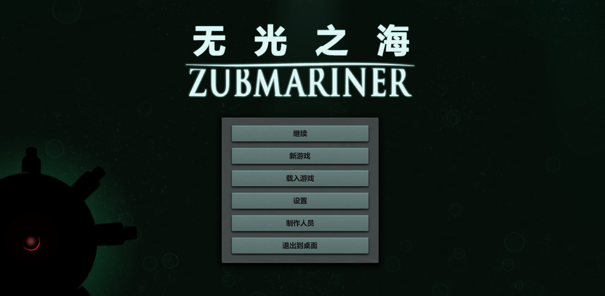
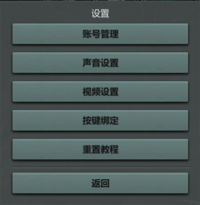
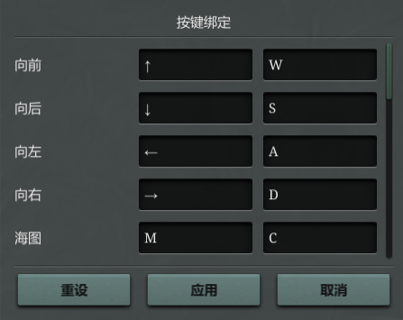
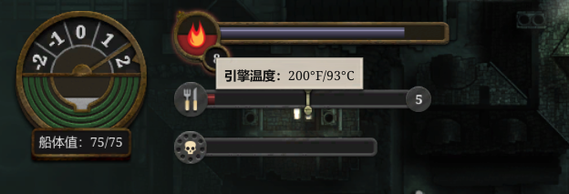
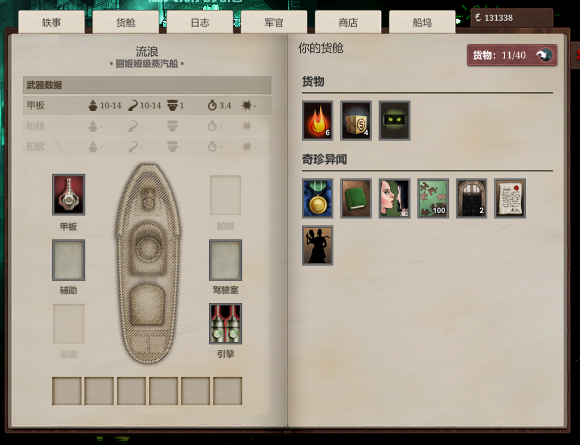
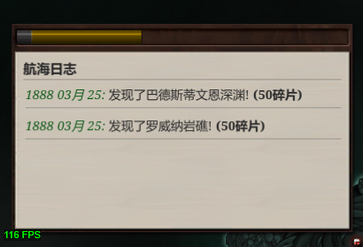

# Sunless Sea 无光之海 UI 中文补丁

游戏 Sunless Sea 的 UI 中文补丁，汉化内容不包括游戏内容。

## 一、安装使用

- GitHub 下载版本 5.4.22 的 BepInEx （[点此前往](https://github.com/BepInEx/BepInEx/releases/tag/v5.4.22)），游戏版本是 32 位的，所以你也要下载 32 位的，我的意思是下载 BepInEx_x86_5.4.22.0.zip，然后解压到 **游戏根目录**，然后运行一次游戏，关闭游戏

- 下载本页面发布的压缩包后（[点此前往](https://github.com/tinygrox/SunlessSeaCN/releases)），解压放入到 `BepInEx\plugins` 目录下，运行游戏即可享受

- 为了应用本项目对游戏启动界面的汉化，玩家还需要手动用任意文本编辑器打开`BepInEx\config\BepInEx.cfg`文件，找到相应字段并修改成与如下内容一致：

  ```ini
  [Preloader.Entrypoint]
  
  ## The local filename of the assembly to target.
  # Setting type: String
  # Default value: UnityEngine.dll
  Assembly = UnityEngine.dll
  
  ## The name of the type in the entrypoint assembly to search for the entrypoint method.
  # Setting type: String
  # Default value: Application
  Type = Camera
  
  ## The name of the method in the specified entrypoint assembly and type to hook and load Chainloader from.
  # Setting type: String
  # Default value: .cctor
  Method = .cctor
  ```

## 二、其他说明

本项目无需替换任何游戏原文件，不想用了直接删除 `BepInEx\plugins\` 下的 `SunlessSeaChineseTranslation` 文件夹即可。

本项目不包括任何游戏内容的汉化，请另寻他处进行下载安装，但本项目的部分翻译参照了 [Instant Comet](https://github.com/InstantComet/SunlessSea) 的版本

本项目的主要技术实现是 **BepInEx** + **HarmonyX**，实际操作中还利用了工具 Unity Explorer 对游戏的控件进行查阅

本项目完全免费，如遇到他人挪用本项目并设置收费的情况，在此特地声明，均与本人无关。

本项目遵循 [](https://creativecommons.org/licenses/by/4.0/) CC-BY 4.0 协议。


注意事项：

- 因游戏代码中大量使用了 `.GetByName()` 方法来获取读取文件内容，这会导致如果直接对游戏内容`json`文件中的`Name`字段进行汉化就会出现问题，所以本项目为了达到应有的汉化效果，对这些地方进行了包括但不限于：IL 重构、方法拦截、方法重写、返回值修改等手段进行处理，这些动作可能会造成一定的性能问题，如果你不幸遇到了性能问题，请直接反馈，反馈时需要指明游戏发生场景，最好能够提供游戏存档，方便定向问题。

- 对于Instant Comet的汉化项目，在此不建议按照其安装说明所说的直接覆盖原文件，而是放入到 addon 文件夹即可。


对游戏内容汉化的建议：

- 在`qualities.json`中，舰船装备槽位（Forward、Deck、Aft、Engines、Bridge、Auxiliary）的"Name"不要汉化，该值会影响对应装备槽位的 UI 显示，因为在游戏代码中是根据其文本来载入指定的 prefab 的，本项目曾经尝试过进行改写，但实现还是过于复杂，实属吃力不讨好的行为，遂在发布版本中丢弃。


## 三、如何支持本项目

如果喜欢本项目，并想要对本项目提供支持，你可以：

- 积极进行使用反馈，提出翻译改进（推荐）
- 向朋友推荐、使用本项目
- 对于认为只有打钱才能充分表示支持的，可去该 [爱发电页面](https://afdian.net/a/tinygrox) 为本人提供一定的资金资助


## 四、游戏内实际预览（搭配了 Instant Comet 的汉化）

首先是游戏主界面：



设置内容的汉化：





为左上角引擎温度的显示添加了额外的摄氏度显示：



舰船面板界面的汉化：



日期格式修改：


